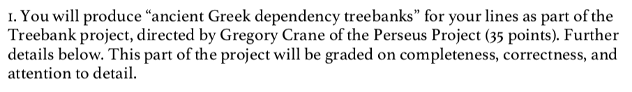
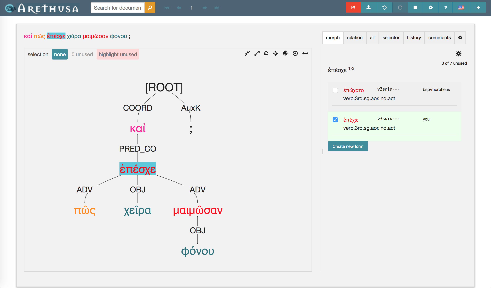
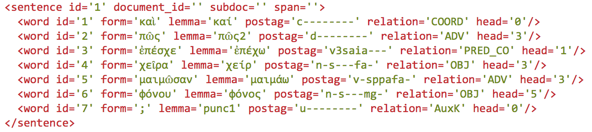
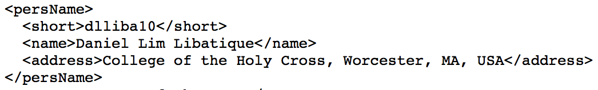
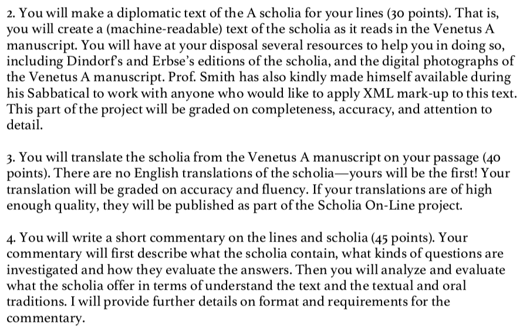
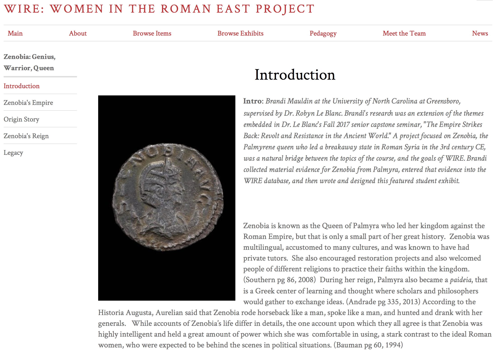
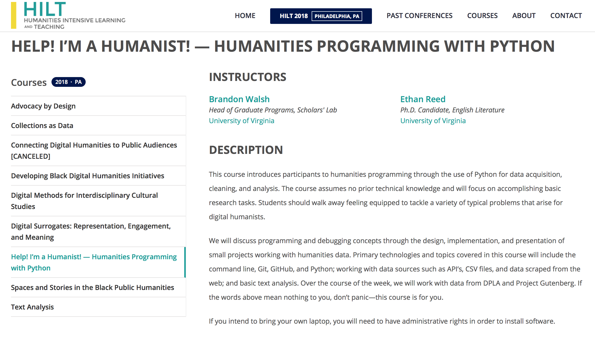
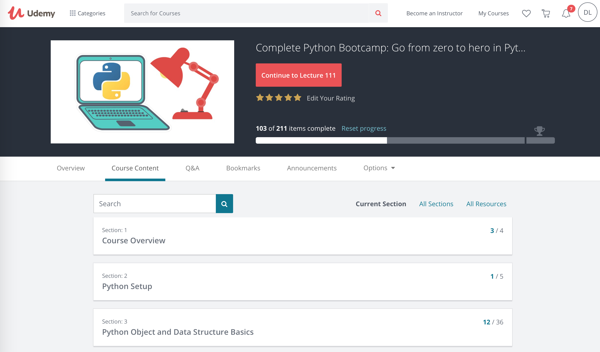
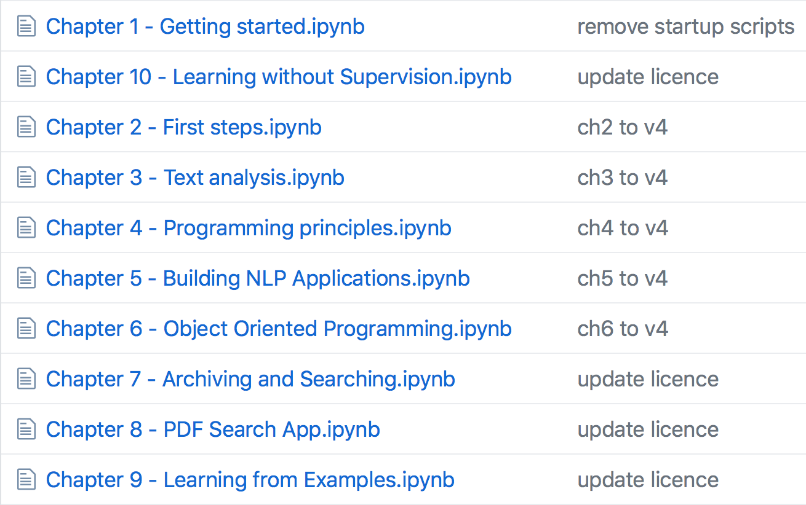
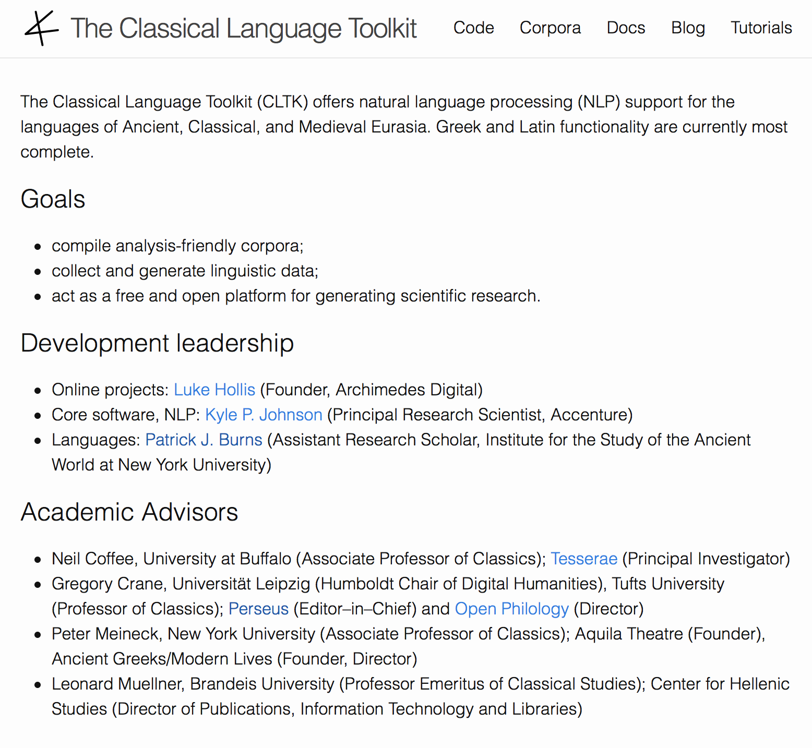

# My Journey into the World of Digital Tools for Classics

TOC:
* [Intro](#intro)
* [Homer in Fall 2008](#homer)
    * [Treebanking](#treebanking)
    * [Scholia](#scholia)
* [Python Course](#python)
* [OGL and SCS/AIA 2018](#ogl)
* [In Conclusion](#conclusion)

# <a name="intro">Intro</a>

I've always considered myself a techie. I've been using a personal laptop since I was a sophomore in high school; I was the first in my friend group to have an iPhone; and Whitaker's Words, Perseus, and Peter Heslin's [Diogenes](https://community.dur.ac.uk/p.j.heslin/Software/Diogenes/) have been helping me with my translation assignments since I was a freshman at the College of the Holy Cross. Those last elements of my *tricolon crescens* were, for a while, the extent of my digital engagement with Classics, but looking back, I can trace the evolution of my interest in digital tools for Classics to three major events.

# <a name="homer">Homer in Fall 2008</a>

The first occurred in the Fall of 2008 when I was a junior at Holy Cross. I was taking an author-level seminar on Homer with Mary Ebbott, who is now known as one of the two Editors of the [Homer Multitext Project](https://www.homermultitext.org) (hereafter HMT), along with [Casey Dué Hackney](https://www.twitter.com/caseyduehackney). At the time, the HMT was in a nascent stage. It was born out of a meeting in 2000 and advanced slowly for years, with various attempts at a reconstruction of the text of the Venetus A and other manuscripts with the involvement of graduate and undergraduate students. A watershed moment came in May 2007, when the editors of the HMT acquired digital images of the three Venice manuscripts, and the work towards what we can find now on the HMT website began.

At the time, I knew none of this backstory (and in fact, I still didn't know much of it until last week, when I e-mailed Mary Ebbott to get some context for this blog post). All I knew was that our final project for the semester was unlike anything that my peers and I had ever done in a seminar before. Thankfully, Professor Ebbott has saved all of her teaching files since she began at Holy Cross, so she provided me with the actual description of the project and its four parts as we received it almost a decade ago. It was divided into two major parts, one dealing with the  text of a section of Book 6 of the *Iliad* and a second dealing with its scholia.

## <a name="treebanking">Treebanking</a>  

The idea of the dependency treebank was to annotate every sentence in our 40-ish line chunk of text in terms of main verbs, subjects, adjectives and which words they modify, participles and their relationship to a word in the sentence or the action of the sentence as a whole, and so on. This was an absolute *dream* of an assignment for a grammar nerd like me. What drew me into Classics in the first place was the languages; the inflections and paradigm charts and syntactic relationships really speak to the way that my mind works. I sometimes feel like I'd be just at home in a field like math or physics in that regard.

The entry process was intuitive. For any given word in a sentence, dropdown menus allowed us to select the proper lemma (dictionary headword) for any given word with possible parsings (e.g., 1st sg. aor. act. ind. for ἔλυσα from the lemma λύω); we could also type in the proper lemma and parsing if Perseus' info was incorrect. Given that this was almost a decade ago, I can't find any screenshots of the treebanking interface as it was back then, but [Arethusa](https://www.perseids.org/tools/arethusa/app/#/), the treebanking interface's latest iteration from [Alpheios](https://alpheios.net), lets you create your own treebanks and annotations. (See below for a screenshot of Arethusa.)

This was/is close reading in its most fundamental form. Every word has to be accounted for, including all the little γε's and μέν's, and you have to make decisions about the relationships of words in a sentence, especially when there are a number of interpretations. I found participles particularly challenging. Properly, a participle is an adjectival form of a verb that syntactically modifies a noun, but its translation serves either only to modify that noun (in an attributive relationship, which would require me to tag the participle "ATR") or qualify the circumstances under which the main verb of the sentence is being performed (in a more adverbial sense, which would require me to tag the participle "ADV" and attach it to the main verb rather than the noun that it modifies; further, if the participle is necessary to complete the sense of the main verb, I'd tag it "OBJ" rather than the optional "ADV"). Let's take a look at a sentence from Sophocles' *Ajax* as an example:

> καὶ πῶς ἐπέσχε χεῖρα μαιμῶσαν φόνου; (Soph. *Aj.* 50)  
"And how did he stay his hand when it was eager for slaughter?"

The participle μαιμῶσαν syntactically modifies the noun χεῖρα. Both are feminine accusative singular. Easy enough. But if I were to tag 
&lt;span style=&quot;font-family: 'GFS Didot'; font-size: 1em;>μαιμῶσαν&lt;/span>
as ATR, an adjective modifying χεῖρα, and attach it to χεῖρα, the implication of the tag and relationship would result in a translation like "How did he stay the hand **which** was eager for slaughter?" The force of the participle is limited to modifying that hand as opposed to any other hand. A better interpretation, I think, would be to take the participle as describing the circumstances in which he would stop his hand, i.e., "**when** (or) **although** it was eager for slaughter." I've used Arethusa to generate my treebank of the sentence, which would look something like this:

  

I confirmed the lemmata and the parsings through the "morph" section to the right and used dropdown menus in the "relation" section to tag each word. This treebank is generated by XML which is created from my choices and looks something like this:

  

Note how μαιμῶσαν attaches to ἐπέσχε rather than χεῖρα. It's a value judgment for sure, but it's one that forces you to make an interpretation based on the evidence in front of you. And this is the process that you have to go through for every word in the text.

This first instance of treebanking led to a year or so as a treebanker for Perseus. The process involved multiple treebankers working on the same text and a third person, a reconciler, managing differences and producing the final annotation. I read some texts that I wouldn't have read otherwise, including odes of Pindar and Hesiod's *Shield*, and I also had the opportunity to annotate an entire text on my own, Sophocles' *Ajax*, the XML for which you can find [here](https://raw.githubusercontent.com/PerseusDL/treebank_data/master/v2.1/Greek/texts/tlg0011.tlg003.perseus-grc1.tb.xml). It's pretty nifty to see my name on a digital publication of sorts! Even if now that I'm looking at it with fresh eyes, I'm already seeing mistakes in the first few sentences ...

  

## <a name="scholia">Scholia</a>

  

The second major part of the assignment was the part that was quite unfamiliar territory for all of us students in the seminar, except for maybe one or two. We had enough trouble reading and translating Iliadic Greek from our carefully prepared critical editions in modern type, let alone from an image of a manuscript. It was quite an interesting exercise, learning what the manuscript's abbreviations meant and translating them essentially from scratch, as there was no commentary or existing translation to help us on our way.

I'll admit that I don't remember much about the actual outcome of my transcription, translation, and commentary, but the use of digital technology, namely digitized images and the ability to zoom, facilitated the task greatly. Digital tools for Classics don't have to entail coding or complex algorithms or crazy detailed knowledge of computer science; they include websites and jpg's and Twitter and other things that we access every day that create for us different modes of experience and engagement than a book or physical photograph would -- not necessarily better (and, arguably, sometimes worse), just different.

The other important takeaway from the experience, now that I look back on it in hindsight, was the ability as an undergraduate to contribute to original and groundbreaking research. My name and the names of my classmates are credited on the [Homer Multitext website](http://www.homermultitext.org/contributors.html). I didn't know as an undergraduate junior what the Homer Multitext Project would become or how our work on the scholia would be used (I'm not sure that anyone did at the time), but to have been part of a project that helps us understand the Homeric poems in novel ways is immensely cool. 

Now that I'm entering academia as a teacher in my own right, I'm actively thinking of ways to engage undergraduate students in Classics research in ways similar to my experiences in the Homer seminar and as a Perseus treebanker. The development of digital tools and corpora is an immensely fruitful way to do so, as some of the tools profiled here on *ergaleia* attest. See, for example, the [Zenobia exhibit](http://wireproject.org/exhibits/show/zenobia--genius--warrior--quee) created by Brandi Mauldin at UNC Greensboro. She used her research on the warrior queen Zenobia to contribute material to the WIRE (Women in the Roman [Near] East) database of ancient artifacts and create an easily accessible exhibit that traces the life and career of Zenobia through material evidence. This is public-facing scholarship with benefits beyond the completion of a semester-long project, inasmuch as Brandi's contributions to the WIRE Project make the information available to anyone else who wants to use it.

 

Another example comes from my alma mater, Holy Cross. Shortly after I graduated (of course -- isn't that always how these things work?), Holy Cross opened up its summer research program to the humanities, and because of our work in the Homer seminar, the department knew that Classics students were prime candidates for summer funding for original research and projects. The success of Classics majors' participation in the summer research program led to the creation of the [HCMID, the Holy Cross Manuscripts, Inscriptions, and Documents Club](https://hcmid.github.io/), a student organization devoted to the study of incompletely published primary sources. Various factions of the group have been presenting at professional conferences around the world, some members have been published (as undergraduates!!), and some of the projects on which they are working are unbelievably innovative and make me wish I'd been born even a few years later so that I could have capitalized on the existence of HCMID as an undergraduate student. The projects include ongoing work on the Homer Multitext, the digitization of [Latin liturgical manuscripts with musical notations called neumes](http://hcmid.github.io/chant/) (click through the link to check out the project website with examples of things you can do with their work!), and [the digital tagging of place and people names in manuscripts of Pliny](https://github.com/HCMID/plinius).

  

As Mary Ebbott writes to me in an e-mail,

>Doing the projects in the seminar really showed us how undergraduates could be involved and contribute. ... When the summer research program at HC was extended to the humanities, we knew that we could do this work with undergrads because of the success of it in the seminar. The success of the summer research led to (1) the MID club at HC and (2) starting HMT undergraduate summer seminars at the Center for Hellenic Studies (we had done it in 2005 and 2007 with graduate students). So you all were trailblazers for the project. If you had failed, who knows what would have happened 😉.

How cool is that? 😎

# <a name="python">Python Course</a>

The second major stop on my journey towards embracing digital tools for Classics occurred almost a decade after the Homer seminar. In the meantime, I graduated Holy Cross, earned my Masters at NYU, and began my Ph.D. at Boston University. In my last year in the BU program, I started becoming good friends with a rising second year in the program, a certain Ryan Pasco, whose name I hope will be familiar as the co-consul of *ergaleia*.

He mentioned that over the summer, he had spent a week in Texas at a course aimed at teaching humanities scholars how to code. The course, entitled "Help! I'm a Humanist! - Humanities Programming with Python," is part of [Humanities Intensive Learning and Teaching (HILT)](http://dhtraining.org/hilt/), an annual digital humanities conference geared towards researchers, students, early career scholars, and cultural heritage professionals who want to learn more about applying digital techniques to their work. This year's HILT (with the same Python course, among others) takes place this year in Philadelphia.

Ryan and I got to talking about the types of things that he learned, including working with text as data, and he mentioned that some of the scholarly areas in which I was interested, including tracing shifts in focalization throughout a large text like Ovid's *Metamorphoses*, were totally viable via coding.

This was me upon hearing that:

The opportunity to participate in HILT was almost 10 months away, however, so I searched online to see if there was anything that I could use to start teaching myself how to code.

This was me upon looking for a place to start:

There are literally dozens, if not hundreds, of viable coding languages and lots of different ways to go about working towards my ultimate goal, which was to use a computer to analyze textual data in an efficient way. I floundered for a bit until I came across this blog post, ["An Affable Guide to Leaving Classics"](http://kyle-p-johnson.com/assets/kyle-johnson-affable-guide-leaving-classics.pdf), by [Kyle Johnson](https://twitter.com/kyle_p_johnson), which made a big impression on me in lots of ways, including through this paragraph that I ended up Tweeting about:

<blockquote class="twitter-tweet" data-lang="en">
Particularly heartened by this (hashtag Python adventures): <a href="https://t.co/HfujrAJ9nl">pic.twitter.com/HfujrAJ9nl</a>
&mdash; Daniel Libatique (@DLibatique10) <a href="https://twitter.com/DLibatique10/status/905130529166680064?ref_src=twsrc%5Etfw">September 5, 2017</a></blockquote> 

So, Python it was. Luckily, there are many resources available online to learn Python. I'd hardly say I'm proficient in Python now, but three resources in particular helped me immensely in gaining a little bit of Pythonic literacy. First was a course through udemy.com created by Jose Portilla entitled ["Complete Python Bootcamp: Go from Zero to Hero in Python"](https://www.udemy.com/complete-python-bootcamp/):

The course was incredibly thorough, starting from the basic concepts of Python and different object types like strings, lists, and dictionaries and methods and functions that one can use on each towards function definitions, lambda expressions, and object oriented programming. I still go back to this course often to check on certain methods and code examples, and it's an amazing resource.

So, learning Python was great through this Udemy course, but how could I apply what I was learning to my Classical interests? Luckily around this time, [Patrick Burns](https://twitter.com/diyclassics) was team-teaching a course at ISAW-NYU entitled, appropriately enough, ["Introduction to Digital Humanities for the Ancient World"](https://diyclassics.github.io/isaw-dh-syllabus/) (syllabus linked here). The schedule for the course included [a series of very helpful Jupyter notebooks](https://github.com/isaw-ga-3024/python-course) created by Folgert Karsdorp, Maarten van Gompel, and Matt Munson on using Python in a humanities context:

These notebooks built on the knowledge that I had gained through the Udemy course and helped me understand how to work with textual data.

A third resource, and in my opinion the holy grail for Python in Classical contexts, is [CLTK, the Classical Language Toolkit](https://cltk.org). It's a toolset that you can use to work with texts in many classical langauges, with ancient Greek and Latin currently the most complete. It includes code, textual corpora, detailed documentation on how to use CLTK code, and tutorials in the form of Jupyter notebooks that help you get started with CLTK in your own research. CLTK's code for Greek and Latin includes many tools for analysis and textual transformation, including lemmatizers (code that returns the dictionary headword for any inflected word), tools for Greek accentuation, part-of-speech tagging, tokenizers (splitting a text into analyzable chunks, like words or sentences), even poetic scansion.

I also have to shout out part of CLTK's leadership, Pat Burns, as my sort of inadvertent coding-for-Classics mentor. We met when he was still a grad student at Fordham when he came to BU to present on Lucan at the graduate conference that I co-organized in 2015. We stayed in touch on Twitter since then, and seeing him combine his work experience as a programmer with his Classical interests helped me realize the potential for digital tools like coding. On a personal note, he's been extremely helpful in looking at and suggesting edits on snippets of my code, and his familiarity with CLTK helped me navigate its structure (and see all the dumb mistakes I make as I try to make use of CLTK's corpora and code).

So, with the combination of Udemy, the ISAW syllabus, and CLTK, I'm feeling a bit more confident as a coder and seeing the potential for textual analysis on a scale that working with physical OCTs or Loebs would render an extremely long and complicated process. Of course, digital tools like Python are not a miraculous panacea that answers every question that a Classicist can ask of their sources; they are aides that make the process of analysis and research more efficient and perhaps more broad than the Classicist originally envisioned.

# <a name='ogl'>OGL and SCS/AIA 2018</a>

The last major stop on this digital journey was quite recent: this year's SCS/AIA Annual Meeting in Boston and the Open Greek and Latin workshop that took place at Tufts University the day before. Since I've written on it at length in two blog posts (part one [here](https://dlibatique.github.io/posts/2018/01/scs1/), and part two [here](https://dlibatique.github.io/posts/2018/01/scs2/)), I won't rehash the details, but simply reinforce the conclusions that the OGL workshop and the SCS Annual Meeting helped me reach.

Digital tools allow for interpersonal connections beyond the confines of physical space, whether at a particular academic institution or at a conference. Communication with someone across the country or indeed across the world is now a matter of a few keystrokes and the click of a mouse or trackpad. Twitter, among other social media platforms, connects scholars and students in ways unheard of even three or four years ago.

The academic life can be a quite lonely one, perpetuated in no small part by the paradigm of the sole scholar going at it alone, coming up with original and innovative ideas and attaching their name alone to the end product. In an age where communication and collaboration are facilitated by digital tools, that no longer needs to be the paradigm, and the digital humanities sect of Classics is a perfect case in point. So many great projects that have real benefits for the Classics community at large are the result of collaboration, including the ones that I've mentioned in this blog post like the Homer Multitext and CLTK. Digital folks also tend to be extremely generous with sharing resources and help, as I've learned firsthand through quick and helpful responses to my countless "what am I doing wrong with this code" and "does anyone have any experience with ____" tweets. The guiding principle of "strength in numbers" has the potential to create a product (whether digital or otherwise) stronger than one created by a lone person.

# <a name="conclusion">In Conclusion</a>

My journey towards embracing digital tools for Classics has had some interesting stops along the way, from a seminar at Holy Cross to the desk in my apartment with Udemy up on my laptop and a glass of red wine next to it to Tufts University and the SCS/AIA 2018 venue in Boston. My graduate program at BU trained me well in the tenets of Classical scholarship, in terms of philological analysis and the incorporation of primary and secondary sources into a novel argument, but this parallel journey of sorts will undoubtedly serve to benefit my scholarly inquiries and pursuits.

I wanted in this blog post to give a brief (oops) explanation of my own personal journey and to share some of the resources that I used to learn. I hope that this reflection causes you, the reader, to think about how digital tools have impacted or can support your scholarly pursuits. Perhaps the digital tools that we profile here on *ergaleia* can give you new insights into your material or argument, but these are just a minor subset of all the digital tools out there. Our goal is to explain a tool's uses and, most importantly, its utility in pedagogical and research contexts; feel free to browse our resources section and let us know if there's a tool that you'd like us or a guest blogger to profile!
