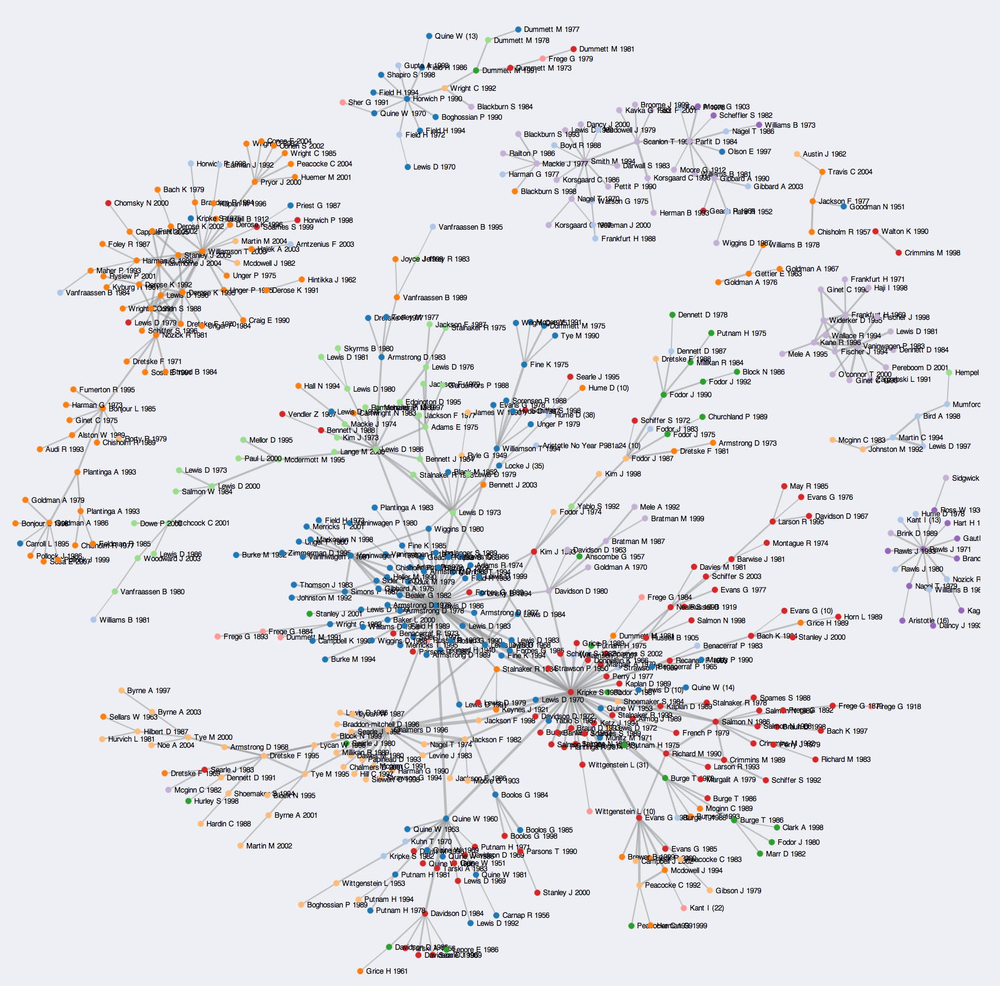

# Mapping Cicero's Letters

As I've mentioned before on Twitter, I'm interested in using the visualization tool Gephi to explore social relationships in Cicero's letters:

<blockquote class="twitter-tweet" data-lang="en">
Gathering up metadata on Cicero&#39;s letters. Plan to import it into Gephi and analyze epistolary correspondence as a sort of &#39;social network&#39;. Github repo: <a href="https://t.co/LbfPcBX6Dl">https://t.co/LbfPcBX6Dl</a> <a href="https://twitter.com/hashtag/ancmakers?src=hash&amp;ref_src=twsrc%5Etfw">#ancmakers</a> <a href="https://t.co/LAD0gkWIMd">pic.twitter.com/LAD0gkWIMd</a>
&mdash; Ryan Pasco (@rympasco) <a href="https://twitter.com/rympasco/status/952334222735429637?ref_src=twsrc%5Etfw">January 14, 2018</a></blockquote>

Now that summer is here, I am excited to devote greater attention to this project. Along the way, I'll be posting brief updates here about the challenges I face and some of my decisions in structuring the project.

The benefits of this are two-fold. First, I believe that doing scholarly work in public view -- however anxiety-inducing -- is a great way to get early and valuable feedback, especially in a project like this that requires proficiencies in many different areas. Second, part of our goal with *ergaleia* is to emphasize the *process* of digital projects in addition to their -- often exciting! -- end results. We at *ergaleia*  have encountered plenty of faculty members that are excited by the potential of new digital tools, but who don't have a good sense of what digital research looks like in practice. In part, *ergaleia* is aimed at them. Digital scholarship done in the open, we hope, will make what seems unapproachable approachable.

With that in mind, I'd like to give a brief introduction to what I aim to achieve in the project, how I came to it, and the software I'm using. This is all quite cursory, and will all be followed up in greater depth in future posts as I get further along.

## Goals

My goal is to make an interactive 'web' of individuals represented in Cicero's letters (addressors, addressees, and those named or alluded to within the bodies of the letters themselves) and their relationships with each other as the letters describe them. Each relationship will be dated to allow the user to watch social relationships as they shift over time; further, the relationships will have a number of attributes assigned to them, such as letter number, letter type, topic of letter, social status/ethnic origins of addressee, etc., that will allow the user to filter through the data and intuitively explore specific questions. For example: does the portrait of social life meaningfully differ in letters on philosophical vs. political topics? If so, how? The end-product will be freely available and, I hope, useful for those asking questions of Cicero's letter collection and also as a pedagogical aid for those teaching about the late Republic.

I am not, of course, the first person to look into the idea of mapping social networks in ancient epistolography. [Benjamin Hicks](https://cdh.princeton.edu/people/benjamin-hicks/) at Princeton is working on mapping Pliny's letters. More relevant to the project at hand, [Caitlin Marley](https://twitter.com/caitlinamarley) of University of Iowa recently defended her dissertation "Sentiments, Networks, Literary Biography: Towards a Mesoanalysis of Cicero's Corpus", in which she examines the emotional plot of Cicero's orations using sentiment analysis, a way of computationally determining the postive/negative emotion of a text or piece of text by tracking the use of positive and negative words throughout. In her project, she also uses Cicero's letters to create a social network and examines the positivity or negativity of correspondence between individuals:

<blockquote class="twitter-tweet" data-lang="en">
To everyone who expressed interest in the idea, look forward the work of Caitlin Marley <a href="https://twitter.com/CaitlinAMarley?ref_src=twsrc%5Etfw">@CaitlinAMarley</a> at U of Iowa, who is wrapping up a diss. on this very subject! <a href="https://twitter.com/hashtag/ancmakers?src=hash&amp;ref_src=twsrc%5Etfw">#ancmakers</a> <a href="https://t.co/mErXCDzszM">https://t.co/mErXCDzszM</a>
&mdash; Ryan Pasco (@rympasco) <a href="https://twitter.com/rympasco/status/952650540315480064?ref_src=twsrc%5Etfw">January 14, 2018</a></blockquote>

By the end of the project, though, I suspect I'll have ventured pretty far in my own direction, as any attempt to render something as messy as social relationships into a rigid scheme will be pretty different from other attempts and will respond to different obstacles by different means. In part, I make my own attempt in order to better familiarize myself with Gephi and social network analysis in general; in later work, I'd like to use social network analysis to examine competition & allusion in the comic fragments, and this project will be a great learning experience.

## Why This Project?

My interest in the project began in my first semester of graduate school when I took a seminar on Latin epistolography. It was my first meaningful look at Cicero's letters; in the process, I became fascinated with one figure, the Etruscan Aulus Caecina, with whom Cicero corresponds (*Ad Fam.* 6.5-8). Over a decade after his own exile, Cicero exchanges letters in 46BCE with Caecina, himself exiled for writing a tract against Caesar.

The letters capture the social positions of Aulus Caecina and Cicero in a brief span of time. Caecina the exile seeks Caesar's forgiveness through Cicero as intermediary, gets updates on his son at Rome, and writes a praise-work of Caesar (with Cicero as editor); Cicero gathers information on Caesar's disposition towards Caecina (through Largus, a friend of the Etruscan), communicates with the absent Caesar's associates Balbus and Oppius, and recommends Caecina to T. Furfanius Postumus and his legates. Without these few letters, we would know little about Caecina or about his relationship with elite Romans. As Seneca writes of Cicero's correspondence with Atticus:

> Nomen Attici perire Ciceronis epistulae non sinunt.
>
> "Cicero's letters do not let the name of Atticus perish".

Perhaps an overstatement in the case of Atticus, but the spirit of the utterance stands: so much of our knolwedge of the period hangs upon this correspondence. My fascination with the letters of Cicero and Caecina, which comprise only a small portion of the *ad Familiares*, only a small part of the picture of social life captured in the letter collection, gave way to an interest in social relationships in the letters of Cicero more broadly. How detailed of a web of social life can we really draw from Cicero's letters? How do the many minor figures that Cicero mentions or writes about fit in? How do social relations change in conjunction with major political events? How might the web of relationships change based on the type or topic of letter or the addressee? How could I begin to collect and sort through so much data? Though interested in these questions, I didn't know the best way to approach them, given the intimidating size of Cicero's collected letters.

## Gephi

It wasn't until I attended [HILT](http://dhtraining.org/hilt/) in 2017 that I learned of a possible approach. A fellow participant introduced me to a [mapping project](http://sites.fhi.duke.edu/ecologyofnetworks/letters-from-distant-lands-carolingian-intellectuals-and-their-networks/) of Carolingian intellectual networks by Clare Woods that uses the program [Gephi](https://gephi.org/). With Gephi, a user can easily create and manipulate visualizations that help to intuitively explore and discover patterns in data.

I will touch on different features of Gephi in subsequent posts as they come up, but for now a brief explanation is in order. Gephi graphs networks made up of actors in a network (called "nodes"). Nodes in the network can be assigned labels -- in the case of Cicero's correspondence, the name of the individual the node represents -- as well as other attributes, like gender, social class, philosophical assocations, etc. The relationship between these nodes are called "edges"; these too can be assigned attributes, such as the type of relationship (addressor-addressee, the genre or topic of letter it takes place in, etc.). These attributes can be used to filter the graph: for example, I may be interested  in displaying only equestrians with at least three connections to other individuals in the network.

These nodes and edges can be changed to communciate different parts of the data: the centrality of a node to the network, i.e. how close it is to other nodes, might be determine its size in the visualization, for example. The completed network can be arranged with a number of layouts that arrange nodes based on specific criteria. I'll write more about this as it comes up, but for now this [tutorial](https://gephi.org/tutorials/gephi-tutorial-layouts.pdf) has some valuable explanations.

Though not made in Gephi specifically, the [Co-Citation Network for Philosophy](https://kieranhealy.org/blog/archives/2013/06/18/a-co-citation-network-for-philosophy/) by Kiernan Healy at Duke is an instructive example:

The network is composed of co-citations of items (if both items are cited in the same book or article, they have a relation) in four philosophy journals from 1993 to 2013. An algorithm arranges the network into 'communities' of interrelated co-citations, which are color-coded based on the community assignments. The resulting visualization -- which you can interact with [here](https://kieranhealy.org/philcites/) captures the contours of academic debate and, as Healy notes, subdisciplinary topics. Healy's network is based upon Neal Caren's [Sociology Citation Network](http://www.unc.edu/~ncaren/cite_network/cites.html) done with Python/[NetworkX](https://networkx.github.io/)/[D3.js](https://d3js.org). 

This is all to provide you a brief glimpse into how social network analysis might look. Before I begin visualizations, though, I need data to visualize and to develop my methodology for gathering this data in the first place. In my next post, I will begin to tackle fundamental issues towards turning messy text into data: what will be my criteria for determining if two individuals mentioned in a letter have a relationship? How do I approach letters that are addressed to/refer to groups of individuals like the Senate? How will I classify types of relationships? For example how do I distinguish the relationships between the addressor and the addressee of a letter (dear Cicero) vs. addressor and an indirect recipient of a message (dear Cicero, tell Caesar that...) vs. individuals referred to at a distance (dear Cicero, I heard that Balbus and Oppius...)?

Until then, stay tuned for updates.
