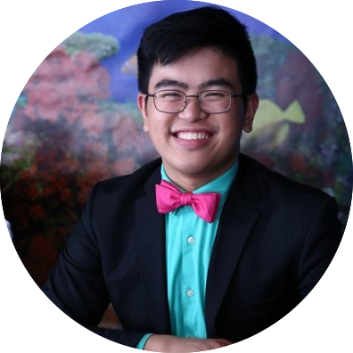

This page was created by Daniel Libatique and Ryan Pasco, graduate students in the Department of Classical Studies at Boston University.

### Daniel Libatique

Daniel is in his sixth year, writing a dissertation entitled *Tereus, Procne, and Philomela: Speech, Silence, and the Voice of Gender* under the direction of Pat Johnson. He graduated with a B.A. in Classics and Theatre from the College of the Holy Cross in 2010 and an M.A. in Humanities and Social Thought from NYU in 2012. His research interests include Greek drama, Augustan poetry, gender, narratology, and reception. In his free time, he is an avid competitive ballroom dancer and a DJ for many ballroom competitions along the East coast. You can find him on Twitter at [@DLibatique10](https://twitter.com/dlibatique10 "DLibatique10").

### Ryan Pasco

Ryan is a second year Ph.D. student. He earned his B.A. in Classical Studies — Ancient Languages in 2015 from Lewis & Clark College. His academic interests include Old Comedy, writing the self, metapoetics/-literature, and digital humanist approaches to scholarship. In his free time, Ryan trains Parkour, practices trapeze, and plays tabletop games. You can find him on Twitter at [@rympasco](https://twitter.com/rympasco "rympasco").

### Other pertinent links:
Daniel's [Github account](https://github.com/dlibatique)  
Ryan's [Github account](https://github.com/rympasco)  
Department of Classical Studies' [website](http://www.bu.edu/classics/)